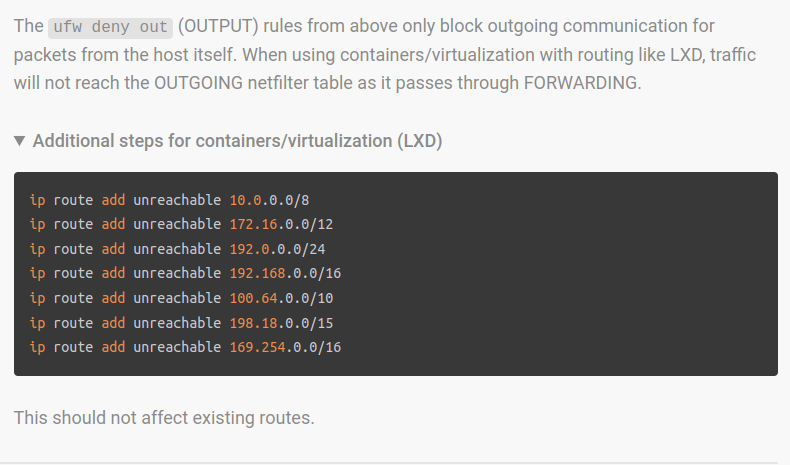

# Hetzner Server Configuration for Blockchain Nodes

1. Boot into Hetzner Rescue System:

a. Log in to your Hetzner account and navigate to the server control panel.
b. Select the server you want to configure.
c. In the 'Rescue' tab, choose the latest available Linux rescue system (64-bit) and activate it.
d. Reboot the server to boot into the rescue system.

2. Prepare the disks for installation:

a. Log in to the server via SSH as root.
b. Identify the available disks using `lsblk` or `parted`:

```bash
lsblk
```

c. Clean the disks and convert them to GPT:

```bash
sgdisk -Z /dev/nvme0n1
sgdisk -Z /dev/nvme1n1
sgdisk -Z /dev/nvme2n1
sgdisk -Z /dev/nvme3n1
```

d. Format the disks with the desired block size:

```bash
nvme format /dev/nvme0n1 --namespace-id=1 --ses=1 --block-size=512
nvme format /dev/nvme1n1 --namespace-id=1 --ses=1 --block-size=512
nvme format /dev/nvme2n1 --namespace-id=1 --ses=1 --block-size=512
nvme format /dev/nvme3n1 --namespace-id=1 --ses=1 --block-size=512
```

3. Install the latest Debian with custom settings using installimage:

a. Run `installimage` to start the installation process.
b. Select 'Debian' and the latest available version from the list of OS images.
c. Edit the configuration file according to your preferences. Make sure to set
the bootloader and ext4 root partition, as well as swraid to 0.
d. Save the configuration and start the installation process. Wait for the
installation to complete and reboot the server.

```installimage.conf
DRIVE1 /dev/nvme0n1
DRIVE2 /dev/nvme1n1
DRIVE3 /dev/nvme2n1
DRIVE4 /dev/nvme3n1
SWRAID 0
SWRAIDLEVEL 0
HOSTNAME spare03
PART swap swap 64G
PART /boot ext3 1024M
PART / ext4 512G
IMAGE /root/.oldroot/nfs/install/../images/Debian-1106-bullseye-amd64-base.tar.gz
```


4. Install ZFS on the server:

a. Log in to the server as root.
b. Update the package list and install required packages:
```bash
apt update
apt install -y zfsutils-linux
```

5. Create a ZFS pool with the desired settings:

a. Get the PARTUUIDs of the disks you want to use for the ZFS pool:
```bash
blkid
```

b. Create a ZFS pool with the desired PARTUUIDs:
```bash
zpool create zfs_storage PARTUUID=disk1 PARTUUID=disk2 PARTUUID=disk3 PARTUUID=disk4
```

Replace `disk1`, `disk2`, `disk3`, and `disk4` with the appropriate PARTUUIDs.

6. Create a ZFS dataset with custom settings for blockchain nodes:
```bash
zfs create -o mountpoint=/mnt/zfs_storage -o sync=standard -o redundant_metadata=most -o atime=off -o logbias=latency -o recordsize=4k zfs_storage/main
```

7. Check the status of the ZFS pool and dataset:
```bash
zpool status zfs_storage
zfs list
```

8. Mount the ZFS dataset:
```bash
zfs mount zfs_storage/main
```

9. Verify the dataset is mounted correctly:
```bash
df -h
```

10. Install Proxmox on top of the Debian base system (optional):

a. Follow the official Proxmox installation guide for detailed instructions.
b. Make any necessary adjustments to the ZFS dataset properties to ensure compatibility
with Proxmox, such as mountpoint, recordsize, or compression settings.

11. Configure your server for optimal performance with your chosen blockchain platform:

a. Depending on your specific blockchain platform (e.g., Polkadot, Ethereum, or others),
follow the official documentation for each platform to ensure proper node setup and configuration.
b. Adjust the ZFS dataset properties as needed to optimize for the specific blockchain
platform you're using.

12. Start and manage your blockchain node:

a. With the ZFS dataset and server configured, you can now start your blockchain node and
manage it according to the specific platform's documentation.
b. Regularly monitor your node's performance and storage usage to ensure smooth operation
and make any necessary adjustments to the ZFS dataset properties as needed.

With these steps completed, your server is now set up with a ZFS storage pool optimized for running blockchain nodes on top of the Debian base system, and optionally with Proxmox installed. Remember to adjust settings and configurations as needed to suit your specific blockchain platform and use case.


## Networking
Accept forward/output traffic into your dhcp CIDR block traffic into internal
IP addresses.

### Private networks
  - "0.0.0.0/8"
  - "10.0.0.0/8"
  - "100.64.0.0/10"
  - "127.16.0.0/12"
  - "169.254.0.0/16"
  - "172.16.0.0/12"
  - "192.0.0.0/24"
  - "192.0.2.0/24"
  - "192.88.99.0/24"
  - "192.168.0.0/16"
  - "198.18.0.0/15"
  - "198.51.100.0/24"
  - "203.0.113.0/24"
  - "224.0.0.0/4"
  - "240.0.0.0/4"
  - "255.255.255.255/32"

### Links
https://github.com/ledgerwatch/erigon/issues/6034 most informative topic regarding
disable ipv6: https://github.com/ledgerwatch/erigon/issues/6117
- echo 1 > /sys/module/ipv6/parameters/disable
- https://www.golinuxcloud.com/linux-check-ipv6-enabled/
- https://community.hetzner.com/tutorials/block-outgoing-traffic-to-private-networks

