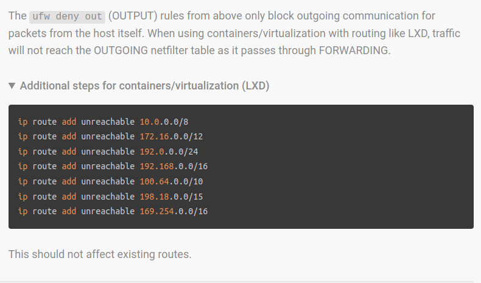

# Networking

### Firewall ruling to block outdoing tarffic to private networks(hetzner)
#### `filter`
This is the default table and is used for filtering packets. It contains three built-in chains:
INPUT, FORWARD, and OUTPUT.

#### `nat`
This table is used for Network Address Translation (NAT). It contains three built-in chains:
PREROUTING, OUTPUT, and POSTROUTING.

##### PREROUTING
- This chain is used for Destination NAT (DNAT). It processes packets as they arrive at the network
  interface before they are routed to their destination. DNAT is typically used for forwarding incoming
  packets from external networks to specific internal hosts.
  - We need to translate public ip+ports into internal ip and ports here.

##### OUTPUT
  - OUTPUT: This chain processes locally-generated packets before they are sent out from the system. 
  In other words, it handles packets originating from the host itself. This chain allows you
  to perform Source NAT (SNAT) or DNAT on locally-generated packets.
###### internal space:
  - "0.0.0.0/8"
  - "10.0.0.0/8"
  - "100.64.0.0/10"
  - "127.16.0.0/12"
  - "169.254.0.0/16"
  - "172.16.0.0/12"
  - "192.0.0.0/24"
  - "192.0.2.0/24"
  - "192.88.99.0/24"
  - "192.168.0.0/16"
  - "198.18.0.0/15"
  - "198.51.100.0/24"
  - "203.0.113.0/24"
  - "224.0.0.0/4"
  - "240.0.0.0/4"
  - "255.255.255.255/32"

##### POSTROUTING
- This chain is used for Source NAT (SNAT). It processes packets after routing has taken place,
  just before they leave the network interface. SNAT is typically used to masquerade
  internal network IP addresses with a single public IP address, making them accessible to external networks.

### Solutions
https://github.com/ledgerwatch/erigon/issues/6034 most informative topic regarding
disable ipv6: https://github.com/ledgerwatch/erigon/issues/6117
- echo 1 > /sys/module/ipv6/parameters/disable
- https://www.golinuxcloud.com/linux-check-ipv6-enabled/
- https://community.hetzner.com/tutorials/block-outgoing-traffic-to-private-networks


To mitigate this issue we added following interfaces file to each container sending problematic traffic:
```bash
auto lo
iface lo inet loopback

auto eth0
iface eth0 inet static
	address 192.168.66.12/24
	gateway 192.168.66.1
  # Add following rules to avoid traffic leaving to internal IP-addresses
	post-up ip route add 192.168.66.1/24 dev eth0
	post-up ip route add unreachable 10.0.0.0/8
	post-up ip route add unreachable 172.16.0.0/12
	post-up ip route add unreachable 192.0.0.0/24
	post-up ip route add unreachable 192.168.0.0/16
	post-up ip route add unreachable 100.64.0.0/10
	post-up ip route add unreachable 198.18.0.0/15
	post-up ip route add unreachable 169.254.0.0/16
```
