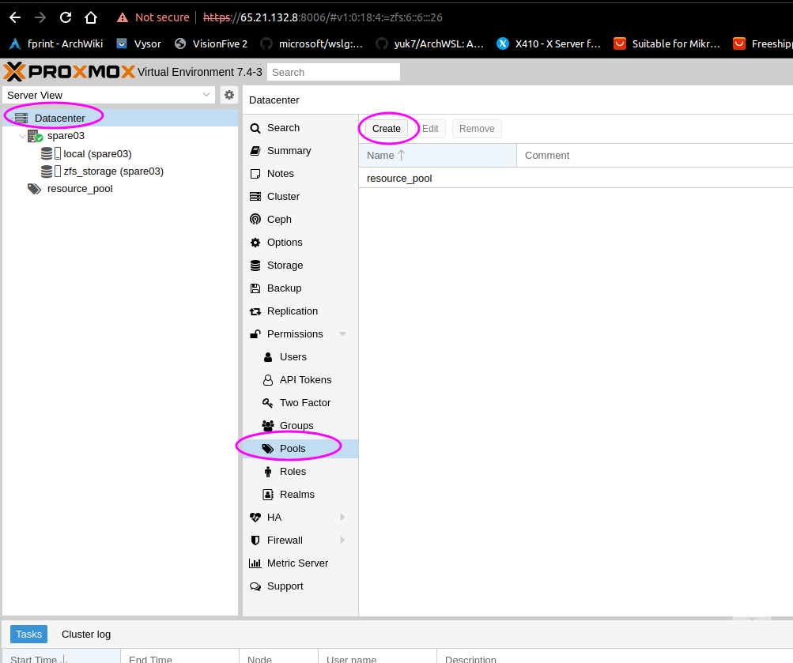

## Proxmox Maintenance

### Creating root partition

1. Use `parted` and `mkpart` to create a root partition (300-500G) with ext4 filesystem for optimal software performance.
2. Create a linux-swap partition equal to 50% of your total RAM.
3. Create a third partition for ZFS, which will be added to the zpool using UUID.
4. Boot from a USB disk and ensure it is the only boot device.

### Add new host

1. Install Debian 11 non-free base OS without GUI, including python3, python3-pip, and openssh daemon.
2. Follow [installation docs](https://pve.proxmox.com/wiki/Install_Proxmox_VE_on_Debian_11_Bullseye).
3. Configure network settings in `/etc/network/interfaces`:

```bash
auto lo
iface lo inet loopback

auto eno2
iface eno2 inet static
 dns-nameservers 1.1.1.1
 address 69.69.69.69/28
 gateway 69.69.69.65
```

5. Restart networking/reboot
6. After it comes back online, log in and add the `ansible.pub` content to `/root/.ssh/authorized_keys`. Set the file mode to 0600 and directory mode to 0700.
7. Add the new host to `ansible/host_vars/$yourhost.yaml` (example for `eur01`):

```yaml
host_name: "eur01.rotko.net"
host_timezone: "Europe/Helsinki"
ansible_host: "69.69.69.69"
role: "proxmox"
```

8. Add the host to `ansible/inventory` under the `proxmox_hosts` section.
9. Apply the `basic_installation.yaml` playbook:

```bash
ansible-playbook playbooks/basic_installation.yaml
```

10. Reboot the machine.
11. Create a ZFS pool using the PARTUUIDs of the disks (not /dev/nvme0n1p1). Example with PARTUUIDs:

```bash
lsblk -lo PARTUUID,NAME,SIZE,MOUNTPOINT
zpool create -o ashift=12 tank 03d4d59a-762c-d149-8e97-1e58a9b01238 3f1fa082-74fd-a94e-83f4-23d4e8c8a157 872a679c-a649-0245-8a6c-e256041eb941 c16da6e1-2f17-8444-8e4a-0256d34655ee
zfs create -o mountpoint=/mnt/tank -o sync=standard -o redundant_metadata=most -o atime=off -o logbias=latency -o recordsize=4k tank/main
```

12. Apply the `proxmox_install_on_debian_host.yaml` playbook:

```bash
ansible-playbook playbooks/proxmox_install_on_debian_host.yaml
```

13. Create a personal administrator account for the Proxmox web UI:

```bash
pveum user add tommi@pve
pveum passwd tommi@pve
pveum acl modify / -user tommi@pve -role Administrator
```

14. Log in to the web UI using your created credentials and ensure the generated tank pool is visible/added as a disk resource. Note that you need to change the "REALM" to pve when logging in.

15. Add manually resource_pool to the datacenter at proxmox panel


- this is required to succesfully create nodes, otherwise you dont have permission to write with scripts to /tank/main 
and hit your head against the wall running ansible scripts without feedback
- terminal: pvesh create /pools -poolid resource_pool

## Container disksize resizing

### Decrease the size

There is no way to decrease the disk size by any "quick" way. One could create a new disk, copy off the data from one disk to another, and then delete the original.

### Increase the size

1. Web UI:

- Login to web ui at <https://$fqdn:8006/>
- Locate the container
- Select resources
- Select the disk you want to resize
- From "Volume actions," choose "resize"
- Enter the amount to add to the storage.

2. Shell

- `pct resize <vmid> <disk> <size> [OPTIONS]` ## This approach uses proxmox to do the resize
- If the container disk is on ZFS, you can use `zfs set` to increase the disk quota, which is essentially the same as "disk size" within zfs. Something like:

```bash
zfs set quota=15G subvol-212-disk-1
zfs set refquota=15G subvol-212-disk-1
```

After these, it is advised that you update the host_vars file for your proxmox host to mirror the new disk space.

## User accounts for proxmox

By default, previously mentioned ansible playbooks that install proxmox will also generate ansible_admin@pve user account. However, this account will not have a password by default (ansible uses token-based authentication). To set a password for that account after installation:

```bash
pveum passwd ansible_admin@pve
```

## Templates

Proxmox uses LXC containers to pre-populate container hosts. Proxmox provides some versions of the base LXC containers automatically, but when new versions of the base image come, old ones are not available anymore. This needs to be remedied typically when setting up a new proxmox host. In Ansible, for the group "all," there's a variable `default_container_template` which needs to reflect what is available in the actual proxmox host. When setting up a new host, drop into the root shell:

```bash
pveam update
pveam available --section system
```

Check for the latest debian-11 release - that has to be made available to the local resource pool. Let's say the version available was: `debian-11-standard_11.3-1_amd64.tar.zst`

Make that available:

```bash
pveam download local debian-11-standard_11.3-1_amd64.tar.zst
```

## Default resource pool
Resource pool is created manually and required for scripts to work. Do it from the proxmox panel and add @rml_admin as Administrator for it as a permission.

More details: <https://pve.proxmox.com/wiki/Linux_Container>
